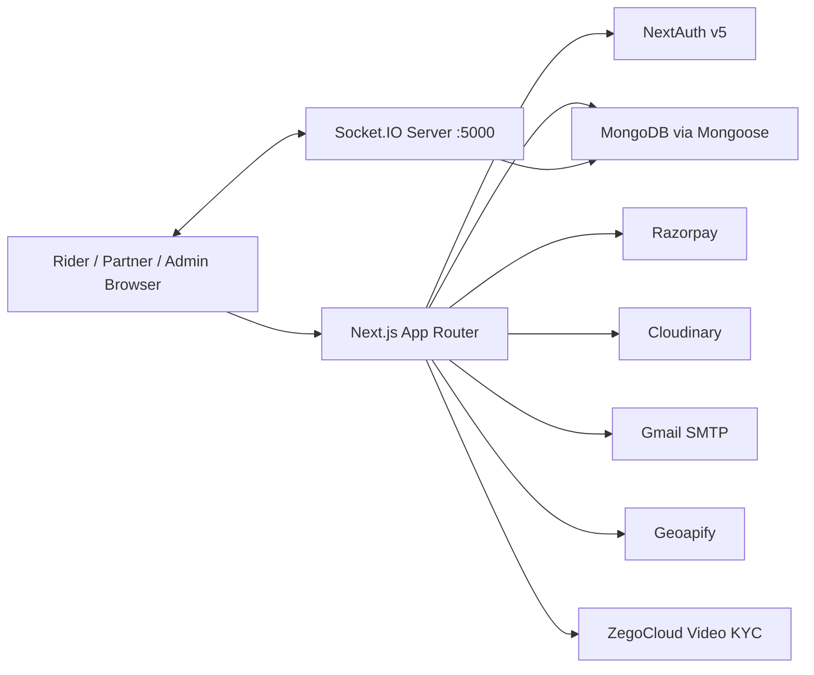
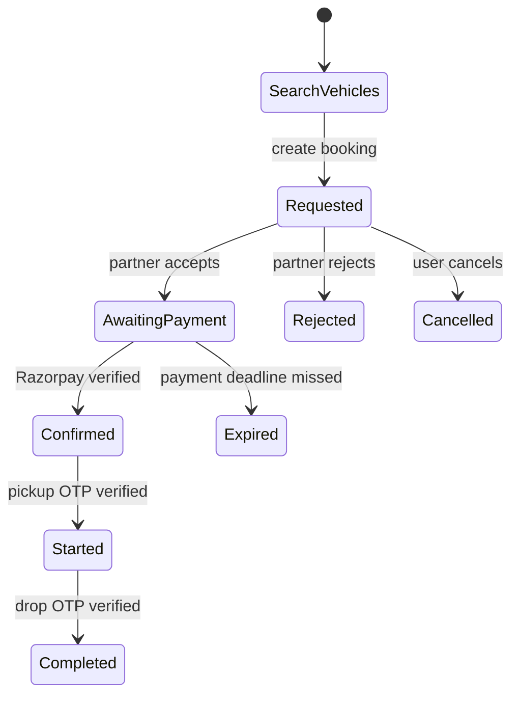
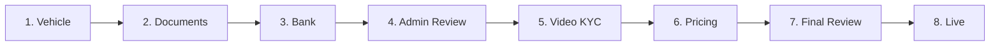
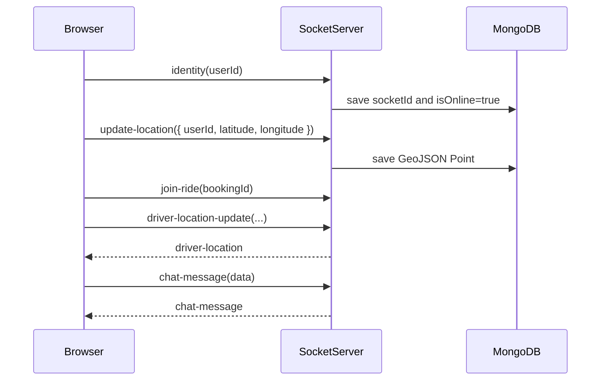
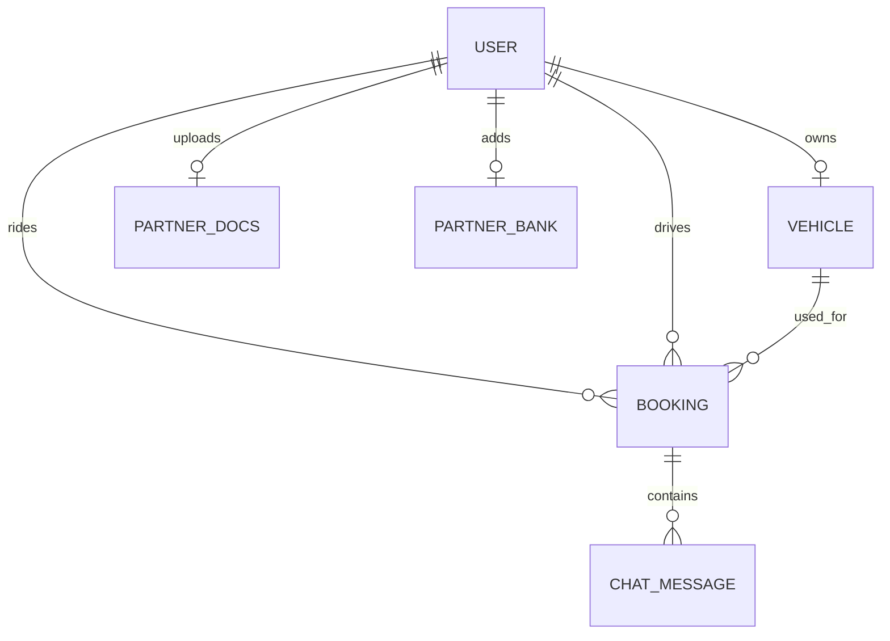

# Rydex

> Smart vehicle booking platform with user ride booking, partner onboarding, admin review workflows, live location updates, ride chat, OTP ride checkpoints, Razorpay payments, and video KYC.

Rydex is a full-stack ride marketplace built with **Next.js 16**, **React 19**, **MongoDB/Mongoose**, **NextAuth v5**, **Socket.IO**, **Leaflet**, **Razorpay**, **Cloudinary**, **Nodemailer**, and **ZegoCloud**. The main app lives in this directory, while the real-time Socket.IO service lives beside it at `../socketServer`.

<p align="center">
  <a href="#quick-start">Quick Start</a> -
  <a href="#features">Features</a> -
  <a href="#architecture">Architecture</a> -
  <a href="#environment">Environment</a> -
  <a href="#workflows">Workflows</a> -
  <a href="#api-map">API Map</a> -
  <a href="#project-map">Project Map</a>
</p>

## Stack

| Layer | Tools |
| --- | --- |
| App framework | Next.js 16 App Router, React 19, TypeScript |
| Styling | Tailwind CSS 4, Geist fonts, Motion |
| Auth | NextAuth v5 beta, credentials auth, Google OAuth |
| State | Redux Toolkit, React Redux |
| Database | MongoDB, Mongoose |
| Maps and geo | Leaflet, React Leaflet, Geoapify, MongoDB geospatial queries |
| Realtime | Socket.IO client plus separate Express Socket.IO server |
| Payments | Razorpay orders and signature verification |
| Uploads | Cloudinary upload streams |
| Mail | Nodemailer with Gmail SMTP |
| Video KYC | ZegoCloud prebuilt UI kit |
| Charts/icons | Recharts, Lucide React, React Icons |

## Features

<details open>
<summary><strong>Rider experience</strong></summary>

- Public landing page with authentication modal.
- Email/password registration with email OTP verification.
- Google OAuth sign-in.
- Search and booking flow for nearby approved partner vehicles.
- Map-assisted pickup and drop selection.
- Active ride and booking history screens.
- Razorpay payment handoff and server-side signature verification.
- Live ride tracking through Socket.IO room updates.
- Ride chat with persisted messages and AI suggestions endpoint.
- Pickup OTP and drop OTP checkpoints.
</details>

<details open>
<summary><strong>Partner experience</strong></summary>

- Partner conversion from regular user during onboarding.
- Vehicle registration with Indian number plate validation.
- Document uploads to Cloudinary.
- Bank detail capture.
- Admin partner review, rejection, and approval path.
- Video KYC request and ZegoCloud room join.
- Pricing setup for base fare, price per kilometer, and waiting charge.
- Pending request list, active ride page, booking history, and earnings.
- Location broadcasting to make approved partners discoverable nearby.
</details>

<details open>
<summary><strong>Admin experience</strong></summary>

- Admin dashboard with partner status KPIs.
- Pending partner review queue.
- Pending vehicle pricing/review queue.
- Pending video KYC queue.
- Partner approve/reject APIs.
- Vehicle approve/reject APIs.
- Video KYC start/complete flow.
- Platform earning view with admin commission tracking.
</details>

## Architecture



The main Next.js application handles UI, auth, API routes, persistence, payment verification, upload orchestration, and admin workflows. The Socket.IO server stores online presence and partner location in MongoDB, then fans out real-time ride events such as driver location and chat messages.

## Quick Start

### 1. Install dependencies

Run these from the repository root:

```bash
cd rydex
npm install

cd ../socketServer
npm install
```

### 2. Configure environment variables

Create `rydex/.env.local` and `socketServer/.env`. See [Environment](#environment) for the full template.

### 3. Start MongoDB

Use a local MongoDB instance or MongoDB Atlas. The app expects `MONGODB_URI` to be present in both the Next.js app and the socket server.

### 4. Start both services

Terminal 1:

```bash
cd rydex
npm run dev
```

Terminal 2:

```bash
cd socketServer
npm run dev
```

Default URLs:

| Service | URL |
| --- | --- |
| Next.js app | `http://localhost:3000` |
| Socket.IO server | `http://localhost:5000` |

## Environment

### `rydex/.env.local`

```bash
MONGODB_URI="mongodb://127.0.0.1:27017/rydex"

# NextAuth
AUTH_SECRET="replace-with-a-long-random-secret"
AUTH_GOOGLE_ID=""
AUTH_GOOGLE_SECRET=""

# Public service URLs
NEXT_PUBLIC_SOCKET_SERVER_URL="http://localhost:5000"

# Mail OTPs
EMAIL="your-gmail-address@gmail.com"
PASS="your-gmail-app-password"

# Cloudinary uploads
CLOUDINARY_CLOUD_NAME=""
CLOUDINARY_API_KEY=""
CLOUDINARY_API_SECRET=""

# Razorpay
RAZORPAY_KEY_ID=""
RAZORPAY_KEY_SECRET=""
NEXT_PUBLIC_RAZORPAY_KEY_ID=""

# Maps
NEXT_PUBLIC_GEOAPIFY_API_KEY=""

# Video KYC
NEXT_PUBLIC_ZEGO_APP_ID=""
NEXT_PUBLIC_ZEGO_SERVER_SECRET=""

# Chat suggestions
GEMINI_API_URL=""
```

### `socketServer/.env`

```bash
PORT=5000
MONGODB_URI="mongodb://127.0.0.1:27017/rydex"
NEXT_BASE_URL="http://localhost:3000"
```

> Note: `socketServer/index.js` declares `MONGODB_URL` but connects with `MONGODB_URI`. Use `MONGODB_URI`.

## Workflows

### Rider booking lifecycle



Key booking states are defined in `src/models/booking.model.ts`:

`idle`, `requested`, `awaiting_payment`, `confirmed`, `started`, `completed`, `cancelled`, `rejected`, `expired`.

### Partner onboarding lifecycle



The partner dashboard uses `partnerOnboardingSteps`, `partnerStatus`, `videoKycStatus`, and vehicle `status` to decide which action is unlocked.

### Real-time lifecycle



## API Map

<details>
<summary><strong>Auth</strong></summary>

| Route | Purpose |
| --- | --- |
| `POST /api/auth/register` | Create or update unverified user and email an OTP |
| `POST /api/auth/verify-email` | Verify registration OTP |
| `/api/auth/[...nextauth]` | NextAuth handlers |
</details>

<details>
<summary><strong>Rider and booking</strong></summary>

| Route | Purpose |
| --- | --- |
| `POST /api/vehicles/near-by` | Find approved nearby vehicles by partner location and vehicle type |
| `POST /api/booking/create` | Create a requested booking |
| `GET /api/booking/active` | Fetch active booking |
| `GET /api/booking/[id]/cancel` | Cancel booking |
| `GET /api/booking/[id]/confirm` | Confirm booking |
| `GET /api/user/bookings` | Rider booking history |
| `GET /api/user/active-ride` | Rider active ride |
| `GET /api/user/me` | Current user profile |
</details>

<details>
<summary><strong>Payments</strong></summary>

| Route | Purpose |
| --- | --- |
| `POST /api/payment/create` | Create Razorpay order and move booking to `awaiting_payment` |
| `POST /api/payment/verify` | Verify Razorpay signature and split fare into admin/partner amounts |
</details>

<details>
<summary><strong>Partner</strong></summary>

| Route | Purpose |
| --- | --- |
| `GET/POST /api/partner/onboarding/vehicle` | Read or submit partner vehicle |
| `POST /api/partner/onboarding/documents` | Upload Aadhaar, license, and RC documents |
| `GET/POST /api/partner/onboarding/bank` | Read or submit bank details |
| `GET/POST /api/partner/onboarding/pricing` | Read or submit pricing |
| `GET /api/partner/video-kyc/request` | Request another video KYC |
| `GET /api/partner/bookings` | Partner bookings |
| `GET /api/partner/bookings/pending` | Pending booking requests |
| `GET /api/partner/bookings/pending-requests-count` | Pending request badge count |
| `GET /api/partner/bookings/[id]/accept` | Accept a requested ride |
| `GET /api/partner/bookings/[id]/reject` | Reject a requested ride |
| `POST /api/partner/bookings/otp/pickup/send` | Send pickup OTP |
| `POST /api/partner/bookings/otp/pickup/verify` | Start ride after pickup OTP |
| `POST /api/partner/bookings/otp/drop/send` | Send drop OTP |
| `POST /api/partner/bookings/otp/drop/verify` | Complete ride after drop OTP |
| `GET /api/partner/my-active` | Partner active ride |
| `GET /api/partner/earning` | Partner earning summary |
</details>

<details>
<summary><strong>Admin</strong></summary>

| Route | Purpose |
| --- | --- |
| `GET /api/admin/dashboard` | Partner KPIs and pending review queues |
| `GET /api/admin/earning` | Platform earning summary |
| `GET /api/admin/reviews/partner/[id]` | Partner review details |
| `GET /api/admin/reviews/partner/[id]/approve` | Approve partner documents/bank and move to KYC |
| `POST /api/admin/reviews/partner/[id]/reject` | Reject partner |
| `GET /api/admin/reviews/vehicle/[id]` | Vehicle review details |
| `GET /api/admin/reviews/vehicle/[id]/approve` | Approve vehicle/pricing |
| `POST /api/admin/reviews/vehicle/[id]/reject` | Reject vehicle/pricing |
| `GET /api/admin/video-kyc/pending` | Pending video KYC partners |
| `GET /api/admin/video-kyc/start/[id]` | Create KYC room and mark in progress |
| `POST /api/admin/video-kyc/complete` | Mark KYC complete or rejected |
</details>

<details>
<summary><strong>Chat</strong></summary>

| Route | Purpose |
| --- | --- |
| `POST /api/chat/send` | Persist chat message |
| `GET /api/chat/get-all` | Fetch messages for a booking |
| `POST /api/chat/ai-suggestions` | Generate chat suggestions through configured Gemini endpoint |
</details>

## Socket Events

The Socket.IO server is in `../socketServer/index.js`.

| Event | Direction | Purpose |
| --- | --- | --- |
| `identity` | client -> server | Attach socket ID to a user and mark them online |
| `update-location` | client -> server | Persist partner/user GeoJSON location |
| `join-ride` | client -> server | Join `ride-{bookingId}` room |
| `driver-location-update` | client -> server -> room | Broadcast driver coordinates to the ride room |
| `chat-message` | client -> server -> room | Broadcast chat message to the ride room |
| `disconnect` | server | Clear socket ID and mark user offline |
| `POST /emit` | HTTP -> socket | Emit an arbitrary event to a user's saved socket ID |

## Data Model



| Model | Important fields |
| --- | --- |
| `User` | `role`, `partnerStatus`, `partnerOnboardingSteps`, `videoKycStatus`, `socketId`, `location`, `isOnline`, OTP fields |
| `Vehicle` | `owner`, `type`, `numberPlate`, `baseFare`, `pricePerKM`, `waitingCharge`, `status`, `isActive` |
| `PartnerDocs` | `owner`, `aadharUrl`, `rcUrl`, `licenseUrl`, `status`, `rejectionReason` |
| `PartnerBank` | `owner`, `accountHolder`, `accountNumber`, `ifsc`, `upi`, `status` |
| `Booking` | rider/driver/vehicle refs, pickup/drop GeoJSON, fare, status, payment status, commission split, OTP fields |
| `ChatMessage` | `bookingId`, `sender`, `text` |

## Project Map

```text
Rydex/
|-- rydex/
|   |-- src/app/                 # App Router pages and API routes
|   |-- src/components/          # Dashboards, booking UI, maps, chat, shared cards
|   |-- src/lib/                 # DB, Cloudinary, Razorpay, mail, socket client
|   |-- src/models/              # Mongoose models
|   |-- src/redux/               # Redux store and user slice
|   |-- src/auth.ts              # NextAuth configuration
|   `-- src/proxy.ts             # Route protection and role gates
`-- socketServer/
    |-- index.js                 # Express and Socket.IO server
    `-- models/user.model.js     # Socket server user model
```

## Important Pages

| Page | Purpose |
| --- | --- |
| `/` | Role-aware home: public site, partner dashboard, or admin dashboard |
| `/user/search` | Vehicle search |
| `/user/book` | Booking form/map flow |
| `/user/checkout` | Razorpay checkout |
| `/user/ride/[id]` | Active ride tracking |
| `/user/bookings` | Rider booking history |
| `/partner/onboarding/vehicle` | Partner vehicle step |
| `/partner/onboarding/documents` | Partner document upload |
| `/partner/onboarding/bank` | Partner bank step |
| `/partner/pending-requests` | Incoming booking requests |
| `/partner/active-ride` | Active partner ride |
| `/partner/bookings` | Partner booking history |
| `/admin/reviews/partner/[id]` | Admin partner review |
| `/admin/reviews/vehicle/[id]` | Admin vehicle review |
| `/video-kyc/[roomId]` | ZegoCloud video KYC room |

## Development Commands

Inside `rydex/`:

```bash
npm run dev      # start Next.js dev server
npm run build    # build production app
npm run start    # serve production build
npm run lint     # run ESLint
```

Inside `socketServer/`:

```bash
npm run dev      # start socket server with nodemon
npm run start    # start socket server with node
```

## Auth and Access Control

Page access control is implemented in `src/proxy.ts`. Most API routes are excluded from the proxy matcher and perform their own session/role checks inside route handlers.

| Area | Rule |
| --- | --- |
| `/` | Public |
| `/admin/*` | Requires authenticated `admin` role |
| `/partner/onboarding/*` | Requires authentication, available during onboarding |
| `/partner/*` | Requires authenticated `partner` role |
| most app pages | Redirect unauthenticated users to `/` |

The home page reads the current session and database user, then renders:

- `AdminDashboard` for admins.
- `PartnerDashboard` for partners.
- `PublicHome` for regular or anonymous users.

## Operational Notes

- MongoDB geospatial search requires user locations to be stored as GeoJSON points. The socket server writes `location.coordinates` as `[longitude, latitude]`.
- Nearby vehicle search currently uses a 10 km max distance.
- Razorpay verification calculates a 10% admin commission and stores the remainder as partner amount.
- Email OTPs and ride OTPs rely on Gmail SMTP credentials configured through `EMAIL` and `PASS`.
- Partner document uploads stream file blobs directly to Cloudinary.
- ZegoCloud credentials are exposed as `NEXT_PUBLIC_*` because the prebuilt UI is initialized client-side.

## Known Setup Pitfalls

| Symptom | Check |
| --- | --- |
| App crashes on boot | `MONGODB_URI` is missing in `rydex/.env.local` |
| Nearby vehicles never appear | Socket server is not running, partner is offline, partner status is not approved, vehicle is not approved/active, or location was never emitted |
| Socket connection blocked | `NEXT_PUBLIC_SOCKET_SERVER_URL` and `NEXT_BASE_URL` do not match the running ports |
| OTP email does not send | Gmail app password is missing or regular Gmail password is being used |
| Payment verify fails | `RAZORPAY_KEY_SECRET` differs from the Razorpay account used in checkout |
| Video KYC does not load | Zego app ID/server secret missing or invalid |

## Future Improvements

- Add `.env.example` files for both services.
- Add seed scripts for admin and sample partner/rider accounts.
- Add tests around booking state transitions, payment verification, and partner approval.
- Add MongoDB indexes for geospatial `User.location` if not already created in production.
- Standardize response status codes for unauthorized requests.
- Move sensitive video token generation server-side if using production-grade Zego security.
