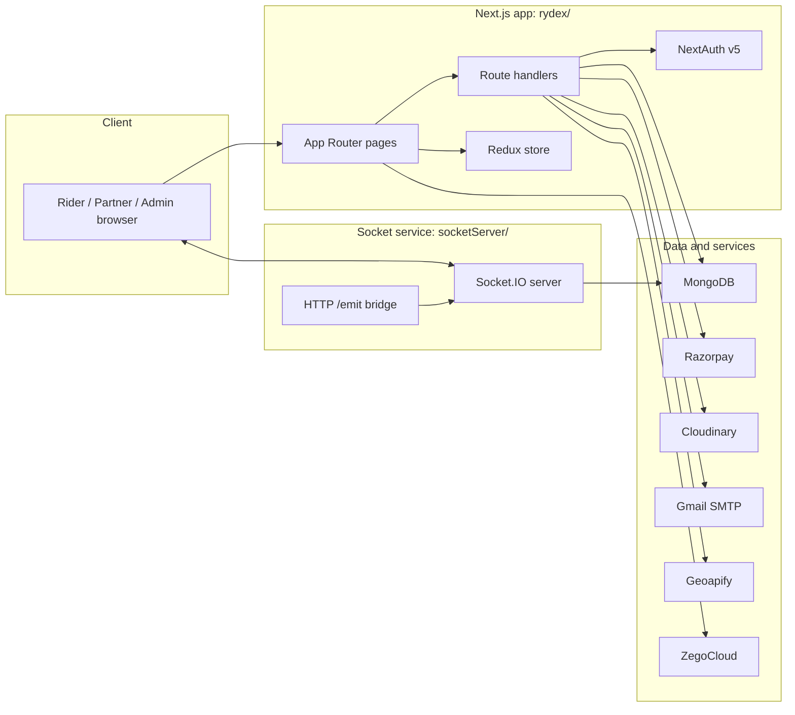
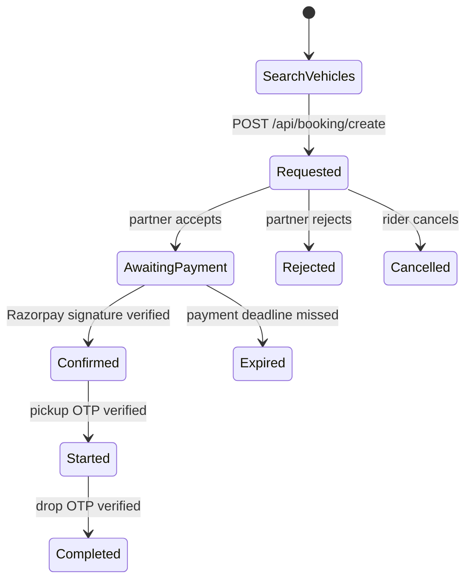
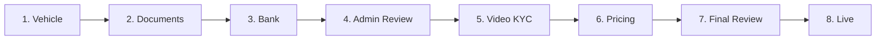
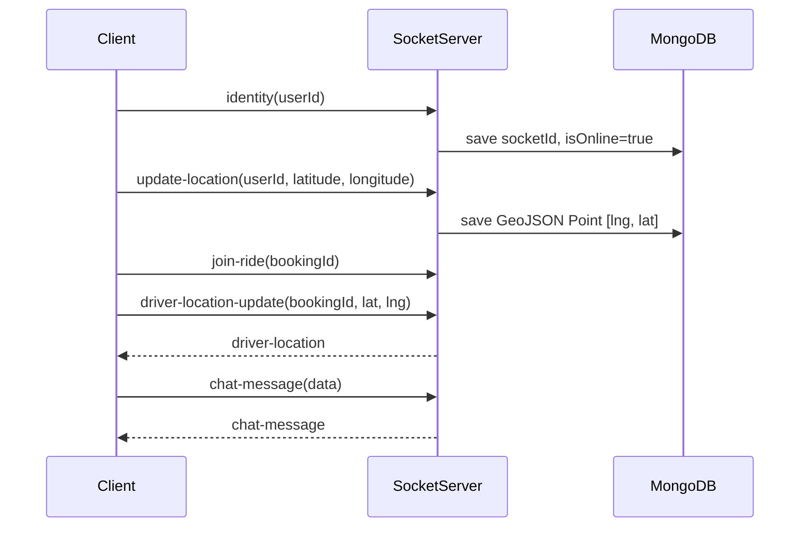
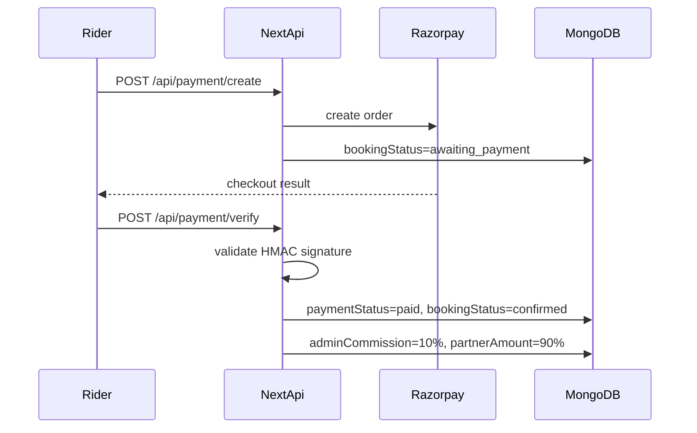
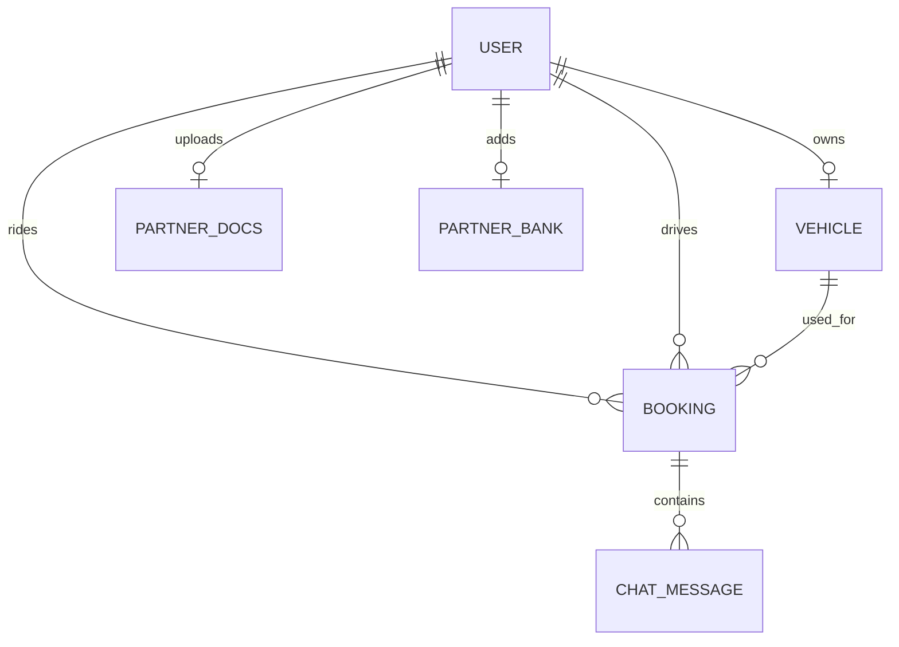
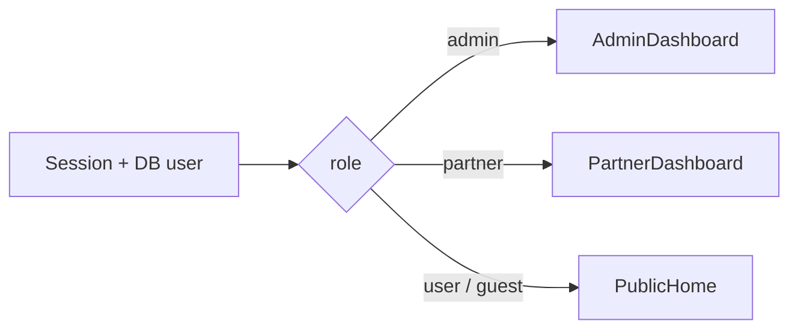

<div align="center">

# Rydex

### Advanced Vehicle Booking Platform

Ride booking, partner onboarding, live ride operations, secure payments, and admin verification in one full-stack system.

[](https://rydex-blond.vercel.app/)
[](https://nextjs.org/)
[](https://react.dev/)
[](https://www.typescriptlang.org/)
[](https://www.mongodb.com/)
[](https://socket.io/)
[](https://tailwindcss.com/)
[](https://razorpay.com/)
[](https://cloudinary.com/)

**Live app:** [https://rydex-blond.vercel.app/](https://rydex-blond.vercel.app/)

<a href="#product-overview">Overview</a>
-
<a href="#system-capabilities">Capabilities</a>
-
<a href="#architecture">Architecture</a>
-
<a href="#quick-start">Quick Start</a>
-
<a href="#workflow-deep-dive">Workflows</a>
-
<a href="#api-reference-map">API Map</a>
-
<a href="#project-structure">Structure</a>

</div>

---

## Product Overview

**Rydex** is a role-based ride booking platform where riders can discover nearby approved vehicles, book rides, pay online, track live movement, and chat with drivers. Partners can onboard with vehicle, document, bank, pricing, and video KYC verification. Admins control the trust layer through review queues, approval workflows, KYC sessions, vehicle pricing checks, and earnings visibility.

The project is organized as a two-service system:

| Service | Path | Responsibility |
| --- | --- | --- |
| Web application | `rydex/` | Next.js app, pages, auth, APIs, dashboards, payments, uploads, database models |
| Realtime service | `socketServer/` | Express + Socket.IO server for online presence, location updates, ride rooms, and chat fanout |

## System Capabilities

<details open>
<summary><strong>Rider platform</strong></summary>

| Capability | What it does |
| --- | --- |
| Account creation | Email/password registration with OTP verification and Google OAuth |
| Vehicle discovery | Searches approved nearby partner vehicles using MongoDB geospatial queries |
| Booking lifecycle | Handles requested, payment, confirmed, started, completed, rejected, cancelled, and expired states |
| Checkout | Creates Razorpay orders and verifies signatures server-side |
| Live ride view | Tracks driver movement through Socket.IO ride rooms |
| Ride chat | Supports real-time chat plus persisted chat history |
| Ride security | Uses pickup and drop OTPs to validate ride start and completion |
</details>

<details open>
<summary><strong>Partner platform</strong></summary>

| Capability | What it does |
| --- | --- |
| Partner onboarding | Converts a normal user into a partner through an 8-step flow |
| Vehicle submission | Captures vehicle type, model, and validated Indian registration number |
| Document upload | Uploads Aadhaar, license, and RC files to Cloudinary |
| Bank setup | Stores payout details and verification status |
| Video KYC | Lets admins create KYC rooms and partners join through ZegoCloud |
| Pricing setup | Captures base fare, per-kilometer price, and waiting charge |
| Operations | Shows pending requests, active ride, completed bookings, and earnings |
| Location availability | Publishes live partner location to make vehicles discoverable |
</details>

<details open>
<summary><strong>Admin platform</strong></summary>

| Capability | What it does |
| --- | --- |
| Review dashboard | Displays partner KPIs and review queues |
| Partner review | Approves or rejects partner document/bank submissions |
| Vehicle review | Approves or rejects vehicle/pricing submissions |
| Video KYC | Starts and completes partner video KYC sessions |
| Earnings | Tracks platform commission and partner payout split |
| Role protection | Restricts admin-only pages through route-level access checks |
</details>

## Tech Stack

| Category | Technology |
| --- | --- |
| Framework | Next.js 16 App Router |
| UI runtime | React 19 |
| Language | TypeScript |
| Styling | Tailwind CSS 4, Geist fonts |
| Motion and UI polish | Motion, Lucide React, React Icons |
| Auth | NextAuth v5 beta, credentials provider, Google provider |
| State | Redux Toolkit, React Redux |
| Database | MongoDB, Mongoose |
| Maps | Leaflet, React Leaflet, Geoapify |
| Realtime | Socket.IO client/server |
| Payments | Razorpay |
| Uploads | Cloudinary |
| Email | Nodemailer with Gmail SMTP |
| Video | ZegoCloud prebuilt video UI |
| Charts | Recharts |

## Architecture



### Runtime Responsibilities

| Concern | Handled by |
| --- | --- |
| Pages and dashboards | `rydex/src/app`, `rydex/src/components` |
| Authentication/session | `rydex/src/auth.ts`, `rydex/src/app/api/auth/[...nextauth]` |
| Route protection | `rydex/src/proxy.ts` |
| Database connection | `rydex/src/lib/db.ts` |
| Business entities | `rydex/src/models/*` |
| Realtime identity/location/chat | `socketServer/index.js` |
| Client socket connection | `rydex/src/lib/socket.ts` |
| Payment order and verification | `rydex/src/app/api/payment/*` |
| File upload | `rydex/src/lib/cloudinary.ts` |
| Email OTP | `rydex/src/lib/sendMail.ts` |

## Quick Start

### 1. Clone and install

```bash
git clone <your-repo-url>
cd Rydex

cd rydex
npm install

cd ../socketServer
npm install
```

### 2. Configure environment

Create local environment files for both services before starting the project:

- `rydex/.env.local`
- `socketServer/.env`

The app expects database, authentication, realtime, email, upload, payment, map, video KYC, and AI suggestion service credentials to be configured locally or in your deployment provider.

### 3. Start the app and socket server

Terminal 1:

```bash
cd rydex
npm run dev
```

Terminal 2:

```bash
cd socketServer
npm run dev
```

### 4. Open locally

| Service | Local URL |
| --- | --- |
| Next.js app | `http://localhost:3000` |
| Socket.IO server | `http://localhost:5000` |

Production app:

```text
https://rydex-blond.vercel.app/
```

## Workflow Deep Dive

### Rider Booking Lifecycle



Booking states are defined in `rydex/src/models/booking.model.ts`:

```text
idle -> requested -> awaiting_payment -> confirmed -> started -> completed
                 \-> rejected
                 \-> cancelled
awaiting_payment -> expired
```

### Partner Onboarding Lifecycle



The partner dashboard is driven by:

| Field | Meaning |
| --- | --- |
| `partnerOnboardingSteps` | Numeric progress through onboarding |
| `partnerStatus` | `pending`, `approved`, or `rejected` |
| `videoKycStatus` | `not_required`, `pending`, `in_progress`, `approved`, or `rejected` |
| `Vehicle.status` | `pending`, `approved`, or `rejected` |

### Realtime Ride Lifecycle



### Payment Lifecycle



## API Reference Map

<details>
<summary><strong>Authentication</strong></summary>

| Method | Route | Purpose |
| --- | --- | --- |
| `POST` | `/api/auth/register` | Create or update unverified user and send email OTP |
| `POST` | `/api/auth/verify-email` | Verify registration OTP |
| `*` | `/api/auth/[...nextauth]` | NextAuth handlers |
</details>

<details>
<summary><strong>Rider and booking</strong></summary>

| Method | Route | Purpose |
| --- | --- | --- |
| `POST` | `/api/vehicles/near-by` | Find approved nearby vehicles by partner location and vehicle type |
| `POST` | `/api/booking/create` | Create requested booking |
| `GET` | `/api/booking/active` | Fetch active booking |
| `GET` | `/api/booking/[id]/cancel` | Cancel booking |
| `GET` | `/api/booking/[id]/confirm` | Confirm booking |
| `GET` | `/api/user/bookings` | Rider booking history |
| `GET` | `/api/user/active-ride` | Rider active ride |
| `GET` | `/api/user/me` | Current user profile |
</details>

<details>
<summary><strong>Payments</strong></summary>

| Method | Route | Purpose |
| --- | --- | --- |
| `POST` | `/api/payment/create` | Create Razorpay order |
| `POST` | `/api/payment/verify` | Verify Razorpay signature and store commission split |
</details>

<details>
<summary><strong>Partner</strong></summary>

| Method | Route | Purpose |
| --- | --- | --- |
| `GET/POST` | `/api/partner/onboarding/vehicle` | Read or submit vehicle |
| `POST` | `/api/partner/onboarding/documents` | Upload Aadhaar, license, and RC documents |
| `GET/POST` | `/api/partner/onboarding/bank` | Read or submit bank details |
| `GET/POST` | `/api/partner/onboarding/pricing` | Read or submit pricing |
| `GET` | `/api/partner/video-kyc/request` | Request another video KYC |
| `GET` | `/api/partner/bookings` | Partner booking history |
| `GET` | `/api/partner/bookings/pending` | Pending booking requests |
| `GET` | `/api/partner/bookings/pending-requests-count` | Pending request count |
| `GET` | `/api/partner/bookings/[id]/accept` | Accept requested ride |
| `GET` | `/api/partner/bookings/[id]/reject` | Reject requested ride |
| `POST` | `/api/partner/bookings/otp/pickup/send` | Send pickup OTP |
| `POST` | `/api/partner/bookings/otp/pickup/verify` | Start ride after pickup OTP |
| `POST` | `/api/partner/bookings/otp/drop/send` | Send drop OTP |
| `POST` | `/api/partner/bookings/otp/drop/verify` | Complete ride after drop OTP |
| `GET` | `/api/partner/my-active` | Partner active ride |
| `GET` | `/api/partner/earning` | Partner earnings |
</details>

<details>
<summary><strong>Admin</strong></summary>

| Method | Route | Purpose |
| --- | --- | --- |
| `GET` | `/api/admin/dashboard` | KPIs and review queues |
| `GET` | `/api/admin/earning` | Platform earnings |
| `GET` | `/api/admin/reviews/partner/[id]` | Partner review details |
| `GET` | `/api/admin/reviews/partner/[id]/approve` | Approve partner and move to KYC |
| `POST` | `/api/admin/reviews/partner/[id]/reject` | Reject partner |
| `GET` | `/api/admin/reviews/vehicle/[id]` | Vehicle review details |
| `GET` | `/api/admin/reviews/vehicle/[id]/approve` | Approve vehicle/pricing |
| `POST` | `/api/admin/reviews/vehicle/[id]/reject` | Reject vehicle/pricing |
| `GET` | `/api/admin/video-kyc/pending` | Pending KYC partners |
| `GET` | `/api/admin/video-kyc/start/[id]` | Create KYC room |
| `POST` | `/api/admin/video-kyc/complete` | Complete or reject KYC |
</details>

<details>
<summary><strong>Chat</strong></summary>

| Method | Route | Purpose |
| --- | --- | --- |
| `POST` | `/api/chat/send` | Persist chat message |
| `GET` | `/api/chat/get-all` | Fetch booking messages |
| `POST` | `/api/chat/ai-suggestions` | Generate suggested replies through configured Gemini endpoint |
</details>

## Socket Event Contract

The realtime service lives in `socketServer/index.js`.

| Event | Direction | Payload / behavior |
| --- | --- | --- |
| `identity` | client -> server | `userId`; stores socket ID and marks user online |
| `update-location` | client -> server | `{ userId, latitude, longitude }`; stores GeoJSON point |
| `join-ride` | client -> server | `bookingId`; joins `ride-{bookingId}` |
| `driver-location-update` | client -> server -> room | Broadcasts driver coordinates as `driver-location` |
| `chat-message` | client -> server -> room | Broadcasts chat message to ride room |
| `disconnect` | server | Clears socket ID and marks user offline |
| `POST /emit` | HTTP -> socket | Emits any event to a saved user socket ID |

## Data Model



| Model | Key fields |
| --- | --- |
| `User` | `role`, `isEmailVerified`, `partnerStatus`, `partnerOnboardingSteps`, `videoKycStatus`, `socketId`, `location`, `isOnline` |
| `Vehicle` | `owner`, `type`, `vehicleModel`, `numberPlate`, `baseFare`, `pricePerKM`, `waitingCharge`, `status`, `isActive` |
| `PartnerDocs` | `owner`, `aadharUrl`, `rcUrl`, `licenseUrl`, `status`, `rejectionReason` |
| `PartnerBank` | `owner`, `accountHolder`, `accountNumber`, `ifsc`, `upi`, `status` |
| `Booking` | `user`, `driver`, `vehicle`, pickup/drop addresses and coordinates, `fare`, `bookingStatus`, `paymentStatus`, OTPs, commission split |
| `ChatMessage` | `bookingId`, `sender`, `text` |

## Project Structure

```text
Rydex/
|-- README.md
|-- rydex/
|   |-- src/
|   |   |-- app/                 # App Router pages and route handlers
|   |   |-- components/          # Dashboards, maps, chat, cards, modals
|   |   |-- hooks/               # Client hooks
|   |   |-- lib/                 # DB, Cloudinary, Razorpay, mail, socket client
|   |   |-- models/              # Mongoose models
|   |   |-- redux/               # Redux store and user slice
|   |   |-- auth.ts              # NextAuth configuration
|   |   `-- proxy.ts             # Page route protection
|   |-- public/
|   |-- package.json
|   `-- next.config.ts
`-- socketServer/
    |-- index.js                 # Express + Socket.IO server
    |-- models/
    `-- package.json
```

## Important Pages

| Route | Experience |
| --- | --- |
| `/` | Role-aware entry: public home, partner dashboard, or admin dashboard |
| `/user/search` | Vehicle search |
| `/user/book` | Pickup/drop booking flow |
| `/user/checkout` | Payment checkout |
| `/user/ride/[id]` | Active ride tracking and chat |
| `/user/bookings` | Rider booking history |
| `/partner/onboarding/vehicle` | Vehicle onboarding |
| `/partner/onboarding/documents` | Document upload |
| `/partner/onboarding/bank` | Bank setup |
| `/partner/pending-requests` | Incoming ride requests |
| `/partner/active-ride` | Active partner ride |
| `/partner/bookings` | Partner booking history |
| `/admin/reviews/partner/[id]` | Partner review |
| `/admin/reviews/vehicle/[id]` | Vehicle review |
| `/video-kyc/[roomId]` | Video KYC room |

## Scripts

### Web app: `rydex/`

```bash
npm run dev      # start Next.js dev server
npm run build    # create production build
npm run start    # serve production build
npm run lint     # run ESLint
```

### Socket server: `socketServer/`

```bash
npm run dev      # start with nodemon
npm run start    # start with node
```

## Access Control

Page access control is implemented in `rydex/src/proxy.ts`. API routes generally perform their own `auth()` and role checks inside route handlers.

| Area | Rule |
| --- | --- |
| `/` | Public role-aware landing route |
| `/admin/*` | Requires authenticated `admin` role |
| `/partner/onboarding/*` | Requires authentication during partner setup |
| `/partner/*` | Requires authenticated `partner` role |
| Protected app pages | Redirect unauthenticated users to `/` |

The root page chooses the dashboard by role:



## Production Notes

| Area | Note |
| --- | --- |
| Deployment | Web app is deployed at `https://rydex-blond.vercel.app/` |
| Realtime | The Socket.IO service must be hosted separately from Vercel serverless routes for persistent connections |
| MongoDB | Add a geospatial index for `User.location` in production if not already present |
| Payments | Keep `RAZORPAY_KEY_SECRET` server-only and use matching public/private keys |
| Video KYC | Client-side public Zego values are used by the current prebuilt UI flow |
| Email | Gmail SMTP requires an app password, not a normal account password |
| Uploads | Cloudinary credentials are used server-side for partner document uploads |

## Troubleshooting

| Symptom | Likely cause |
| --- | --- |
| App fails on boot | `MONGODB_URI` is missing or invalid |
| Google sign-in fails | `AUTH_GOOGLE_ID`, `AUTH_GOOGLE_SECRET`, or OAuth redirect URI is wrong |
| Nearby vehicles are empty | Partner is offline, not approved, vehicle not approved/active, location not emitted, or socket server is down |
| Socket connection blocked | `NEXT_PUBLIC_SOCKET_SERVER_URL` and socket `NEXT_BASE_URL` do not match running origins |
| OTP email does not arrive | Gmail app password missing or SMTP credentials invalid |
| Razorpay verify fails | Signature secret does not match checkout key/account |
| Video KYC does not open | Zego credentials missing or room ID not generated by admin |

## Roadmap Ideas

- Add `.env.example` files for both services.
- Add seed scripts for admin, rider, and partner accounts.
- Add tests around booking state transitions, Razorpay verification, and partner approval.
- Add socket integration tests for ride rooms and location broadcasts.
- Add stronger error normalization for route handlers.
- Move production video token generation server-side.
- Add deployment documentation for the Socket.IO service.

---

<div align="center">

Built as a full-stack ride operations system with booking, trust, realtime, and payment workflows.

[Open Live App](https://rydex-blond.vercel.app/) - [Back to Top](#rydex)

</div>
